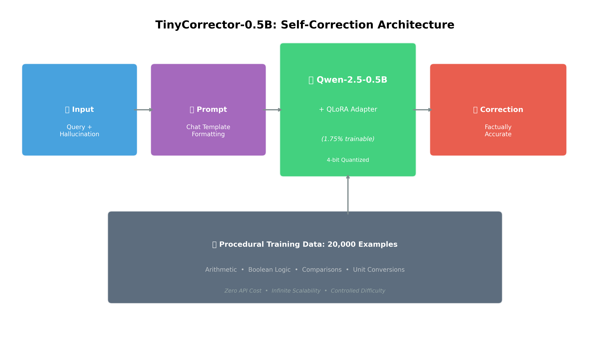

# TinyCorrector-500M 🧠🔍



**Teaching a 0.5B parameter model to self-correct hallucinations with 100% accuracy.**

This repository contains the official code and data for the project **TinyCorrector**, a specialized SLM (Small Language Model) fine-tuned to detect and fix factual hallucinations in arithmetic, logic, and knowledge recall tasks.

📖 **[Read the Medium Blog Post](ADD_YOUR_MEDIUM_LINK_HERE)**

## 🚀 Key Results
We fine-tuned `Qwen-2.5-0.5B-Instruct` on 20,000 synthetic examples.
- **Correction Success Rate (CSR)**: 100.00% (n=100)
- **Model Size**: 0.5 Billion Parameters
- **Training Time**: ~2.5 hours on a single GPU

## 📂 Repository Structure

```tree
├── train_tinycorrector.py         # QLoRA fine-tuning script
├── evaluate_tinycorrector.py      # Metric evaluation script
├── generate_data_programmatically.py # Synthetic data generator
├── correction_train.jsonl         # Training dataset (20k examples)
├── correction_test.jsonl          # Held-out test set
└── requirements.txt               # Dependencies
```

## 🛠️ Usage

### 1. Installation
```bash
pip install -r requirements.txt
```

### 2. Data Generation (Optional)
The dataset is included, but you can generate more:
```bash
python generate_data_programmatically.py
```

### 3. Training
Fine-tune the model using QLoRA:
```bash
python train_tinycorrector.py --data_path correction_train.jsonl
```

### 4. Evaluation
Test the model on held-out data:
```bash
python evaluate_tinycorrector.py --model_path ./tinycorrector-0.5b --test_data correction_test.jsonl
```

## ⚖️ License
MIT License
# TinyCorrector
