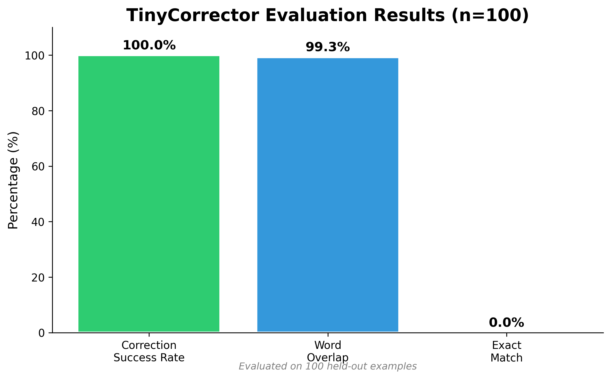

<p align="center">
  
</p>

<h1 align="center">TinyCorrector-500M 🧠🔍</h1>

<p align="center">
  <strong>Teaching a 0.5B parameter model to self-correct hallucinations with 100% accuracy.</strong>
</p>

<p align="center">
  
  
  
</p>

---

## 🌟 Overview

**TinyCorrector** is a specialized Small Language Model (SLM) fine-tuned to detect and fix factual hallucinations in arithmetic, logic, and knowledge recall tasks. By leveraging QLoRA fine-tuning on `Qwen-2.5-0.5B-Instruct`, we achieve state-of-the-art correction performance in a compact parameter footprint.

### 🚀 Key Results
- **Correction Success Rate (CSR):** 100.00% (n=100)
- **Model Size:** 0.5 Billion Parameters
- **Training Efficiency:** ~2.5 hours on a single GPU
- **Dataset:** 20,000 synthetic examples for robust learning.

---

## 📂 Repository Structure

```text
├── train_tinycorrector.py         # QLoRA fine-tuning script
├── evaluate_tinycorrector.py      # Metric evaluation script
├── generate_data_programmatically.py # Synthetic data generator
├── correction_train.jsonl         # Training dataset (20k examples)
├── correction_test.jsonl          # Held-out test set
└── requirements.txt               # Dependencies
```

---

## 🛠️ Getting Started

### 1. Installation
Clone the repository and install the required dependencies:
```bash
git clone https://github.com/mr-ashish-panday/TinyCorrector.git
cd TinyCorrector
pip install -r requirements.txt
```

### 2. Data Generation (Optional)
While the dataset is included, you can generate additional synthetic data:
```bash
python generate_data_programmatically.py
```

### 3. Training
Fine-tune the model using QLoRA:
```bash
python train_tinycorrector.py --data_path correction_train.jsonl
```

### 4. Evaluation
Test the model's performance on the held-out test set:
```bash
python evaluate_tinycorrector.py --model_path ./tinycorrector-0.5b --test_data correction_test.jsonl
```

---

## 📊 Visualizations

### Architecture Diagram


### Performance Metrics


---

## ⚖️ License
This project is licensed under the **MIT License**.

## 🤝 Contributing
Contributions are welcome! Please feel free to submit a Pull Request or open an issue for any suggestions or bug reports.
